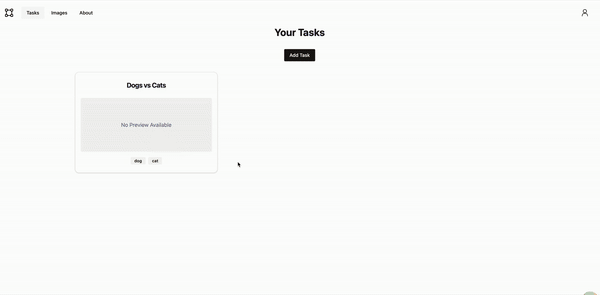

# MernBboxAnnotations

> This is a simple annotation app developed in one week just for code showcase.



## Run Locally

1. To run app locally, create a new Mongo DB and pass the access string to env file
2. Run commands:

```sh
npm i
npx nx run server:serve-both
```
